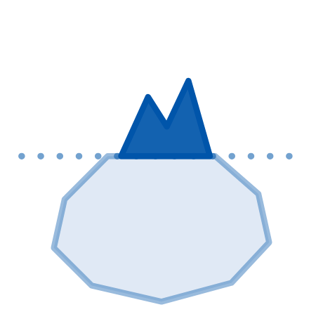

# Parte I — Comportamento e Visibilidade {.parte .unnumbered}

*Onde o trabalho existe, mas ninguém vê.*

{.parte-icone width=7cm}

Esta primeira parte reúne os padrões mais persistentes da minha trajetória: fazer um bom trabalho e não comunicá-lo, automatizar antes de validar, esperar ser perguntado em vez de tomar a frente. São erros de comportamento, não de competência técnica — e talvez por isso sejam os mais difíceis de enxergar sozinho.
